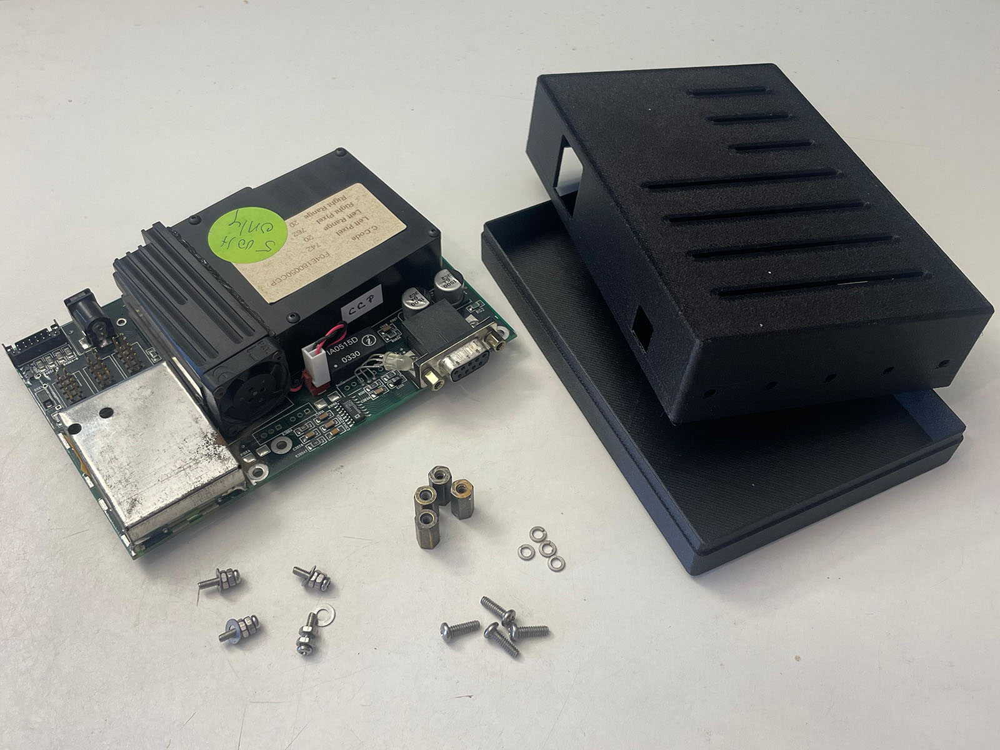
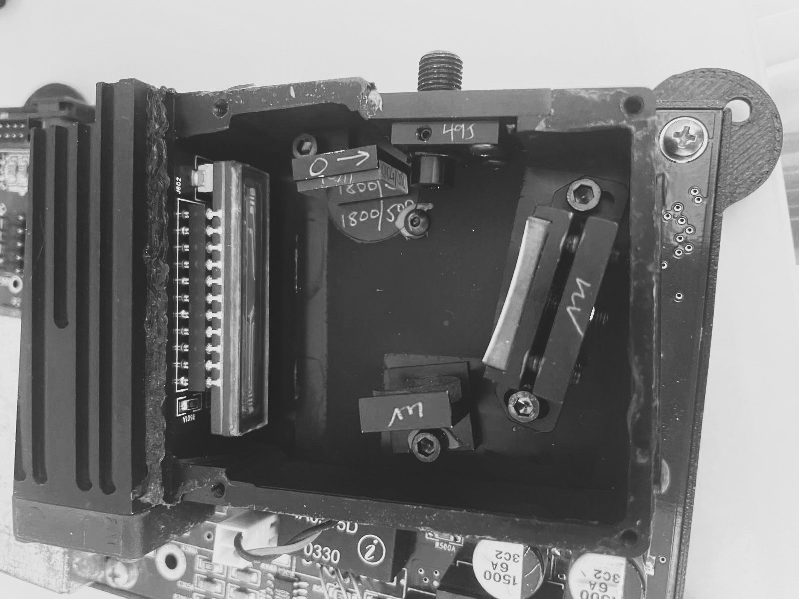
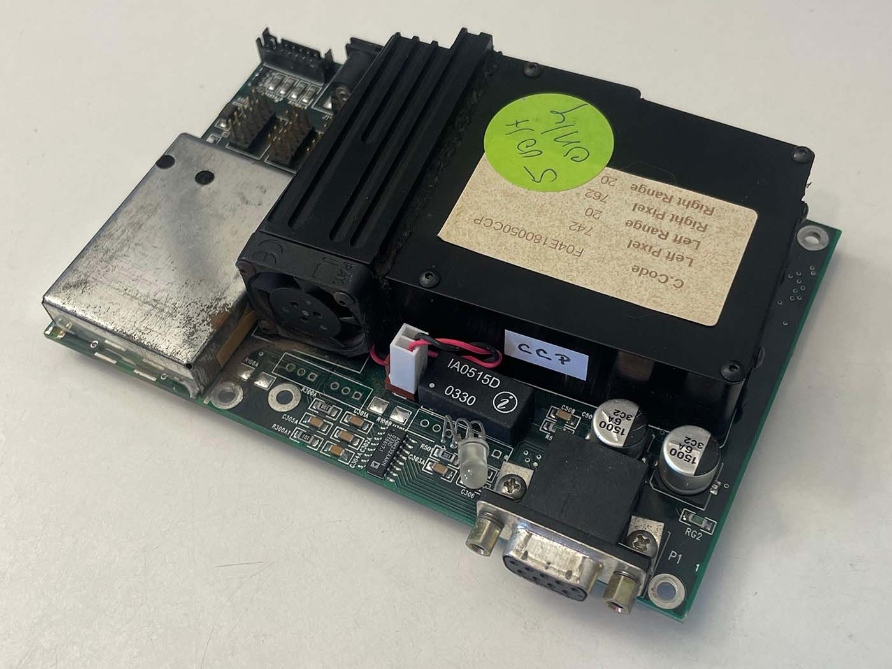
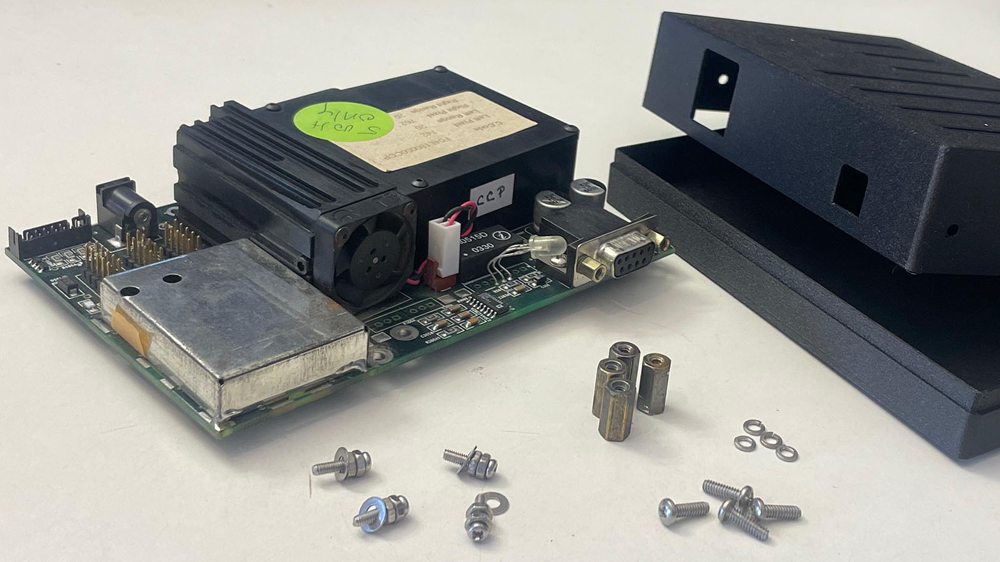
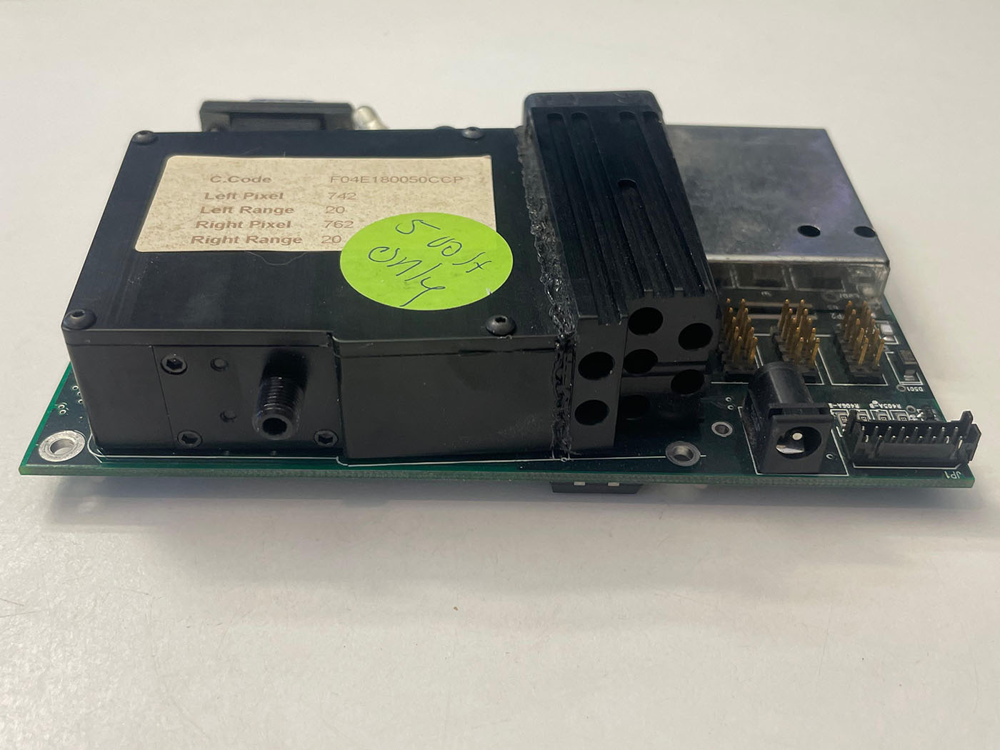
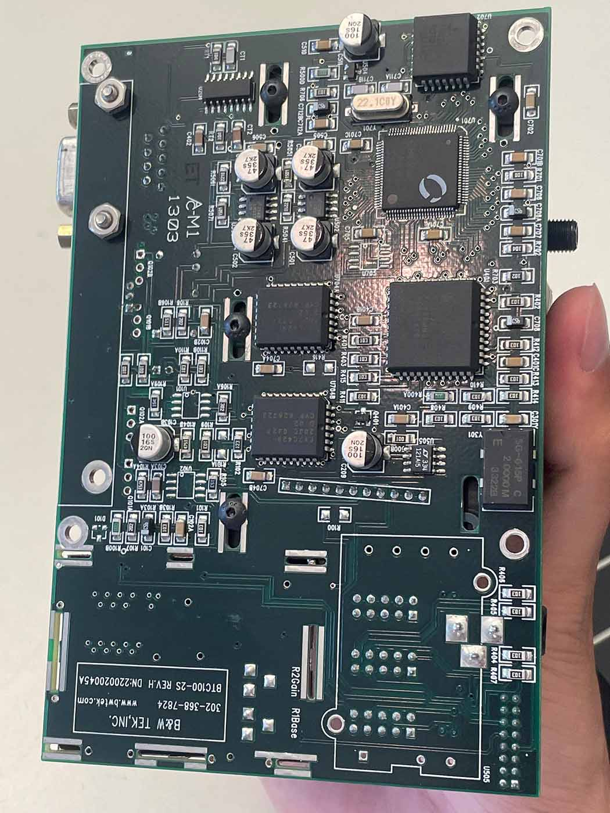
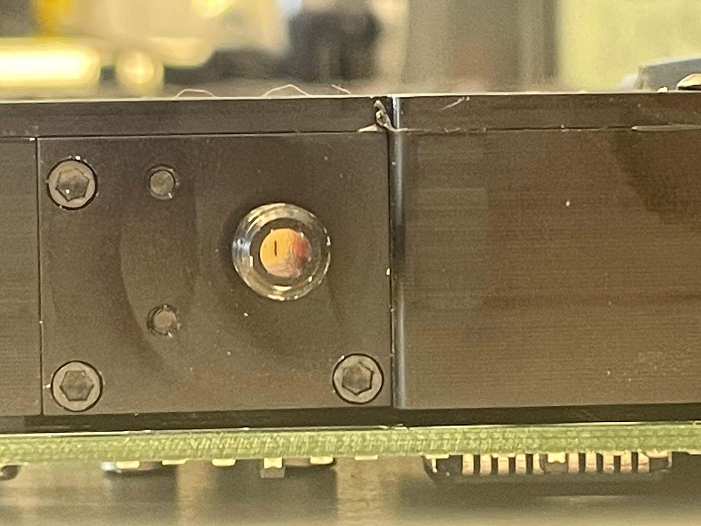

# Spectrometer Unit (B&W Tek BTC-110S)

This module describes how to prepare, house and use the [**B&W Tek BTC-110S**](https://www.ebay.com/itm/143989529085) spectrometer board as the detector for the DIYraman system.

It covers inspection and cleaning, the 3D-printed housing, first power-up, acquiring spectra, and basic wavelength calibration.

***For an in-depth look into the capabilities and operation of the unit, visit this blog post ["Home Optical Spectrometry: The B&W Tek BTC100-2S"](https://www.sevarg.net/2023/01/28/bw-tek-btc100-spectrometer/) on Sevarg.net!***

---

## Jump to

- [1. Parts and Tools](#1-parts-and-tools)
- [2. Inspect and Clean the Unit](#2-inspect-and-clean-the-unit)
- [3. 3D-Printed Housing](#3-3d-printed-housing)
- [4. Powering On and Connecting](#4-powering-on-and-connecting)
- [5. Acquiring a First Spectrum](#5-acquiring-a-first-spectrum)
- [6. Wavelength Calibration](#6-wavelength-calibration)
- [7. Upgrade Options (Optional)](#7-upgrade-options-optional)
- [Appendix – Background](#appendix--background)

---

## 1. Parts and Tools

### 1.1 Sourced parts

| Part               | Minimum spec / example                                                            | Notes                                                                                |
| ------------------ | --------------------------------------------------------------------------------- | ------------------------------------------------------------------------------------ |
| Spectrometer board | **B&W Tek BTC-110S** ([Available on eBay](https://www.ebay.com/itm/143989529085)) | Main detector module.                                                                |
| Power supply       | 5 V, ≥ 3 A, barrel jack connector                                                 | Must be stable and regulated.                                                        |
| Data cable         | RS-232 to USB adapter cable                                                       | Choose a chipset compatible with your OS (many FTDI / Prolific chips work reliably). |
| Calibration source | CFL or mercury-vapour / calibration lamp                                          | Needs several sharp lines near ~550 nm for wavelength calibration.                   |

> [!TIP] Budget builds  
> Used BTC-110S boards are available on eBay but may also appear via surplus or auction sites and are much cheaper than new spectrometers or even buying the parts.

---

### 1.2 Tools

- Small **hand blower** (camera cleaning blower) or compressed inert gas  
- Lint-free cloth and **99 % isopropanol**  
- Cotton swabs  
- Basic screwdrivers and hex keys (for standoffs / case)  
- 3D printer capable of PETG or PETG-CF  
- PC or laptop with Windows and:
  - Original B&W Tek software (re-hosted)  
  - Optional: DIYraman acquisition software (see [Software – README](../../software/README.md))

---

## 2. Inspect and Clean the Unit

Before printing parts or powering anything, make sure your spectrometer arrived intact. 

### 2.1 Visual overview

  

  

Check:

- PCB is not bent or cracked.  
- SMA905 input stud is straight and the glass slit is intact.  
- Heatsink, fan and connectors are firmly attached.

### 2.2 Cleaning

1. Use a blower or compressed gas to gently **dust off the PCB and the fan**.  
2. Lightly dampen a lint-free cloth with **99% isopropyl alcohol (IPA)**.  
3. Wipe non-optical surfaces: metal case, heatsink, backside of the PCB.  
4. Use cotton swabs with a small amount of isopropanol to clean tight areas.  
5. **Do not touch** the slit glass, sensor or any exposed optical surfaces directly. 

> [!WARNING] Health & safety – sanding fibre-filled plastics  
> When sanding or trimming 3D-printed parts made from PETG-CF or other fibre-filled filaments, wear at least a **surgical mask or FFP2/FFP3 respirator**. Fine carbon fibres can accumulate in your lungs with repeated exposure. 

---

## 3. 3D-Printed Housing

The BTC-110S is an exposed PCB assembly. A simple printed case protects it from dust, stray light and accidental damage.

### 3.1 Printed parts

| ID  | Name                           | Qty | Print notes |
| --- | ------------------------------ | --- | ----------- |
| 201 | `Spectrometer-Case_Bottom.stl` | 1   |             |
| 202 | `Spectrometer-Case_Top.stl`    | 1   |             |

#### Print orientation & fit

If parts / holes are too tight or too loose:

- **Too tight:** very lightly ream or sand the holes, then remove dust.  
- **Too loose:** adjust XY compensation / hole expansion in your slicer and reprint. 

> [!TIP] Print seams for precise holes  
> Avoid seam placement directly inside precise holes. Random seam positioning often yields better clearance for functional features.

---

## 4. Powering On and Connecting

This section gets the spectrometer powered and talking to your computer. 

**For an in-depth look into the capabilities and operation of the unit, visit this blog post ["Home Optical Spectrometry: The B&W Tek BTC100-2S"](https://www.sevarg.net/2023/01/28/bw-tek-btc100-spectrometer/) on Sevarg.net!**

### 4.1 Warm-up

1. Connect the **5 V / 3 A power supply** to the barrel jack.  
2. Plug it in – there is no power switch, so you immediately hear the small fan spin up.  
3. Leave the unit on for **≈ 10 minutes** before serious measurements.

The BTC-110S uses a **thermoelectric cooler (TEC)** plus heatsink and fan to stabilise the sensor temperature. Starting measurements immediately after power-on leads to higher background noise and random spikes until the temperature settles!

### 4.2 RS-232 to USB adapter

Connect the RS-232 adapter between the DB-9 port and your PC. 

> [!NOTE] USB–RS-232 compatibility  
> Some USB–RS-232 chipsets behave poorly on non-Windows systems or inside virtual machines. A mid-range cable from a known brand (e.g. Ugreen / FTDI-based) tends to work more reliably than ultra-cheap clones.

---

## 5. Acquiring a First Spectrum

For initial testing, use the **original B&W Tek software** ([Spectrum Studio - Click to Download](https://drive.google.com/file/d/1ooKja8GXg5gMX-swFjbmAXFP61ucyWT_/view?usp=sharing)) to confirm that communication and data acquisition work as expected.

### 5.1 Software setup

1. Start the OEM software with the spectrometer powered.  
2. If it doesn’t auto-detect the device:  
   - Click **“Detect Spectrometer”** in the toolbar.  
   - Wait for the blank graph to appear.  
3. Open the **“Calibrate”** window (gear icon at the right of the toolbar).  
4. Set parameter **C1 = 1** at the bottom and confirm with **OK** – this enables the wavelength calibration features you’ll need later.

### 5.2 Understanding integration time and averaging

- **Integration time** ≈ camera shutter speed.  
  - ~50 ms: quick checks and rough alignment.  
  - 1500–20000 ms: typical range for final Raman measurements.  
- **Averages**: number of individual spectra that will be acquired and averaged, even when you press **“Scan Once”**. During acquisition, the software shows the most recent scan, then updates to the averaged, background-subtracted spectrum at the end.

### 5.3 Capturing and subtracting background

1. Block the input slit (e.g. with your finger, a printed cap or tape).  
2. Start an acquisition with typical settings.  
3. Use the **green arrow icon** in the left toolbar (background submenu) to:  
   - Capture the current spectrum as **background**.  
   - Apply it to subsequent scans.

This background remains active and will be subtracted from all new spectra until you clear or update/replace it.

> [!WARNING] Re-acquire background after changing integration time  
> Whenever you change the **integration time**, capture a **new background**. The OEM software does not warn you or clear the old background automatically – it will otherwise subtract an incorrect background.

---

## 6. Wavelength Calibration

Proper wavelength calibration maps each CCD pixel index to a physical wavelength in nanometres. This step is essential for **correctly scaled Raman shifts**. 

### 6.1 Choose a calibration source

A good calibration source has:

- Several sharp, well-documented emission lines  
- Lines close to the region of interest (around 550 nm for a 532 nm Raman system)

Suitable options:

- Mercury-vapour lamp (ideal, easiest)  
- CFLs with visible mercury lines (abundant, low-cost)  
- Dedicated calibration lamps from astronomy suppliers (more expensive)

You can find reference spectra and line lists for mercury-vapour lamps in many spectroscopy references and online databases.

### 6.2 Record calibration data

1. **Acquire and apply a background** of the sensor noise.
	- If the spectrometer was just powered on, leave it running for roughly 10 minutes until the measured noise stabilizes.
2. Turn off all lights in the room to avoid stray lines. 
3. Place the calibration lamp so light enters the slit (directly or via SMA fibre, if used).  
4. Adjust integration time until you get:  
   - Clearly visible peaks  
   - No saturated pixels  

Now use the software’s **cursor tool** (two icons above background subtraction in the left toolbar):

5. Drag the vertical line to each prominent spectral peak.  
6. For each peak, note:
   - The **pixel index** (x-axis value before calibration)  
   - The **known wavelength** (from your reference data)

Collect at least **4 calibration points** across the usable range – more points give a better fit.

### 6.3 Least-squares fitting

1. Open the **Calibrate** window again.  
2. Switch to the **“Least-Squares Fitting”** tab.  
3. Enter all recorded **pixel indices** and **wavelengths** into the table.  
4. Let the software compute the calibration coefficients.  
5. Write these values down or take a screenshot for future reference.  
6. Confirm with **OK**, then take another scan.

The x-axis should now be displayed directly in **nanometres** instead of raw pixel numbers.

### 6.4 Quick sanity check

> [!DANGER] Laser safety  
> Never look directly into the beam or reflections, and be especially careful with cheap DPSS lasers that may leak significant invisible infrared!  

1. Gently shine a **green 532 nm laser** at the entrance slit.  
   - Avoid over-exposing the sensor; use reflections or a diffuser if needed.  
2. Acquire a spectrum and check the main laser line:  
   - Expect a peak somewhere around **528–536 nm**, depending on laser quality and calibration accuracy.  
3. If the peak is significantly off, re-check your calibration points. 

---

## 7. Upgrade Options (Optional)

These upgrades are **not required** to get a working Raman spectrometer, but can improve performance once the basic system runs reliably.

### 7.1 SMA905 fibre input

- The BTC-110S was designed to accept light via an **SMA905 fibre** threaded onto the entrance stud.  
- For many basic experiments and even Raman work, you can feed light directly into the slit without a fibre.  
- Fibre coupling is useful to:
  - Position the spectrometer unit outside of the [Overpressure Glove Box](Overpressure%20Glove%20Box.md).  
  - Route the signal over a longer distance.  
  - Re-use an existing fibre probe.

### 7.2 Protective slit cap

To protect the fragile 50 µm glass slit, you can add a simple screw-on cap:

- Download the provided **spectrometer screw cap** 3D model.  
- Print in black (or dark) filament:  
  - ≤ 0.2 mm layer height  
  - Random seam position  
- If the thread fit is off: scale the model slightly in XYZ (uniformly) and re-print.

### 7.3 Internal optics and grating

Many forum posts suggest tweaking mirrors or replacing the diffraction grating to increase resolution near the Raman region. While possible, this has trade-offs:

- Any misalignment can **ruin the instrument alignment** until fixed.  
- Adjustments need to be done:
  - In a **glove box** or dark enclosure  
  - With great patience and very small iterative changes

> [!TIP] Leave internal optics untouched (at first)  
> Leave the internal optics **as-is** until your full Raman system works and you have experience aligning external optics. Out-of-the-box performance of typical BTC-110S units is usually sufficient for 532 nm Raman in the 600–1650 cm⁻¹ region. 

---

## Appendix – Background

### A.1 Where the BTC-110S comes from

The BTC-110S was originally used inside the *Carotenoid Antioxidant Scanner* (NuSkin Pharmanex S3 BioPhotonic Scanner), a device marketed by a large MLM company. While the surrounding product and claims were questionable, the embedded spectrometer appears to be a legitimate and capable module – and is now available online.

### A.2 Spectrometer role in DIYraman

In the DIYraman system, the BTC-110S:

- Receives filtered Raman-scattered light from the optical assembly  
- Disperses it via an internal grating onto a linear CCD array  
- Outputs digitised intensity vs. pixel index, which is converted into:  
  - **Wavelength (nm)** after calibration  
  - **Raman shift (cm⁻¹)** in later software steps  

Its specified range is roughly **400–725 nm**, originally optimised for 400–580 nm, but still well suited for the **Stokes region** above a 532 nm excitation, even with a 550 nm long-pass filter. In practice, most useful Raman bands (≈450–1650 cm⁻¹) fall within the captured region, even if the very lowest shifts below ~600 cm⁻¹ are clipped. 
